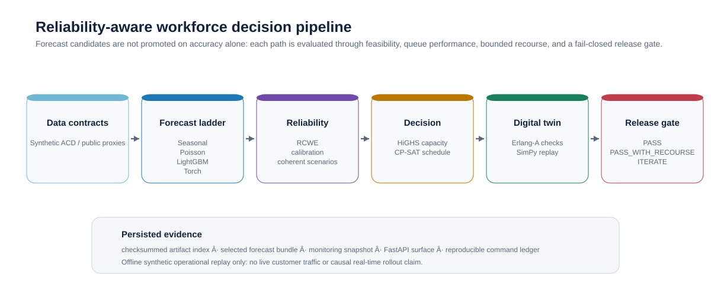
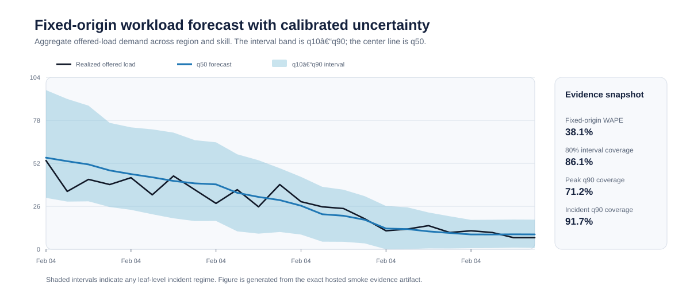
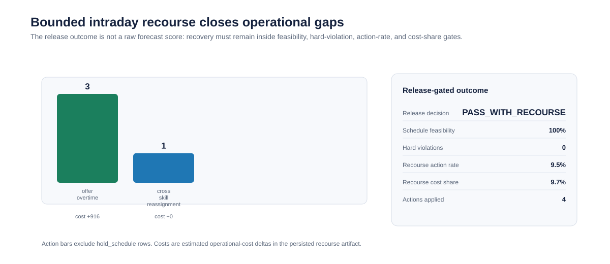
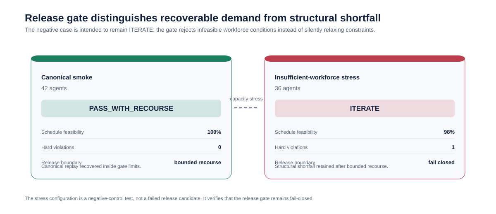

# Reliability-Aware Support Forecasting & Workforce Optimization

[](https://github.com/ReviveCoding/support-capacity-reliability-platform/actions/workflows/ci.yml)
[](https://github.com/ReviveCoding/support-capacity-reliability-platform/actions/workflows/codeql.yml)
[](https://github.com/ReviveCoding/support-capacity-reliability-platform/releases/tag/v1.4.1rc2-windows-qualified-v25)

A reliability-first, offline Applied Science framework that converts uncertain support demand into tested contact-center workforce decisions. The pipeline compares forecasting candidates, applies the Reference-Conditioned Workload Envelope (RCWE), creates coherent operating scenarios, optimizes capacity and schedules, evaluates a multi-skill queueing digital twin, applies bounded intraday recourse, and only publishes a decision after a fail-closed release gate.

> **Claim boundary:** all canonical outcomes are offline synthetic operational replay. No AWS internal, customer, or proprietary contact-center data is used, and simulated cost, SLA, abandonment, and staffing results are not live business impact.

## Validated snapshot

The figures and metrics below are generated from the exact GitHub-hosted smoke and negative-gate artifacts for commit [`e66caf8`](https://github.com/ReviveCoding/support-capacity-reliability-platform/commit/e66caf8cef9b6cefa677a0d90e29d010b79ae9a5), CI run [`28462033837`](https://github.com/ReviveCoding/support-capacity-reliability-platform/actions/runs/28462033837), and CodeQL run [`28462033948`](https://github.com/ReviveCoding/support-capacity-reliability-platform/actions/runs/28462033948).

| Forecast reliability | Decision reliability | Queue outcome | Release outcome |
|---|---|---|---|
| Fixed-origin WAPE **38.13%**<br>80% interval coverage **86.11%** | Schedule feasibility **100%**<br>Hard violations **0** | Simulated service level **99.47%**<br>Abandonment **0.36%** | **PASS_WITH_RECOURSE**<br>Bounded recourse action rate **9.52%** |



## Why this is a decision-reliability platform

A demand forecast is not promoted because it has the lowest error alone. Forecast candidates are selected using time-ordered evaluation and calibration, then evaluated through scenario coherence, capacity planning, availability-aware scheduling, queue performance, bounded recourse, and release gates. The latest deterministic smoke run selects `lightgbm+rcwe`.



The forecasting protocol deliberately separates: (1) time-ordered one-step model comparison, (2) calibration-only fitting, (3) fixed-origin recursive forecasting for the decision horizon, and (4) earlier policy-tuning replay from the locked frozen evaluation. Future observed AHT, patience, shrinkage, and regime labels are never used as forecast inputs.



The canonical result is `PASS_WITH_RECOURSE`, not an unconditional pass. That means the base schedule requires explicitly bounded recovery actions and must still satisfy schedule feasibility, hard-violation, action-rate, cost-share, service-level, abandonment, and wait-time gates.



The 36-agent insufficient-workforce configuration is a deliberate negative control. It is expected to remain `ITERATE`, proving that the system fails closed rather than silently relaxing an infeasible workforce requirement.

## What the repository demonstrates

- **Forecasting and uncertainty:** seasonal heuristics, Poisson count regression, LightGBM quantile forecasting, optional GPU-ready PyTorch quantile training, optional Chronos-2, temporal validation, interval calibration, and fixed-origin recursive inference.
- **Research specialty:** Reference-Conditioned Workload Envelope (RCWE), latent/offered/served workload separation, low-reference-support interval inflation, and explicit undercoverage versus excess-capacity trade-offs.
- **Decision science:** coherent joint scenarios, strategic capacity MILP, tactical CP-SAT scheduling, multi-skill Erlang-A and SimPy queue replay, recourse-aware policy selection, and tail-risk release gating.
- **Reliability engineering:** strict Pydantic configuration, deterministic seeds, isolated worker execution, atomic publication, checksummed artifacts, persisted model-bundle replay, monitoring snapshots, FastAPI endpoints, packaging, CI, and failure-preserving execution.

## Reproduce the canonical paths

```bash
python -m pip install --upgrade pip
python -m pip install ".[dev]"
python -m pip check

# Cross-platform qualification
python scripts/qualify_local.py --profile CORE

# Canonical offline replay: expected PASS or PASS_WITH_RECOURSE
support-capacity run --config configs/smoke.yaml --require-release

# Negative gate: expected ITERATE
support-capacity run --config configs/stress_insufficient_workforce.yaml --expected-status ITERATE
```

The canonical smoke path uses deterministic synthetic ACD and workforce data, 42 agents including a reserve pool, and does not require PyTorch or external downloads. The stress path uses 36 agents and is expected to retain structural coverage failure after bounded recourse.

## Qualification evidence

The release tag [`v1.4.1rc2-windows-qualified-v25`](https://github.com/ReviveCoding/support-capacity-reliability-platform/releases/tag/v1.4.1rc2-windows-qualified-v25) pins the qualified functional commit. The current release evidence is summarized in [`docs/release_qualification.md`](docs/release_qualification.md).

| Evidence surface | Exact scope | Result |
|---|---|---|
| Windows local clean release | Fresh short-root extraction, fresh Python 3.11 environment, package bootstrap, `pip check`, STANDARD qualification | PASS |
| GitHub-hosted CI | Windows Python 3.11; Ubuntu Python 3.11, 3.12, 3.13; release smoke; optional CPU PyTorch; insufficient-workforce negative gate | PASS |
| Static security analysis | CodeQL Python analysis | PASS |
| Docker runtime | Docker build/run | Not executed |
| GPU / Chronos full mode | CUDA and foundation-model execution | Not executed; not claimed |

## Project layout

```text
configs/                      Deterministic smoke, stress, torch, and full configurations
src/support_capacity_reliability/
  forecasting/                Forecast candidates and optional-model adapters
  reliability/                RCWE, calibration, scenarios, and release gates
  optimization/               Strategic capacity, tactical scheduling, and recourse
  queueing/                   Erlang approximations and SimPy digital twin
  api/                        FastAPI health, staffing, and pipeline endpoints
scripts/                      Qualification, smoke, distribution, bundle, and figure rendering tools
docs/                         Architecture, methodology, operations, limitations, and qualification evidence
tests/                        Unit, integration, contract, lifecycle, and E2E coverage
```

## API and persisted artifacts

```bash
make api
# GET  /health
# POST /required-staffing
# POST /run-pipeline
```

A completed run publishes `run_summary.json`, `artifact_index.json`, model-bundle verification inputs, monitoring diagnostics, forecast metrics, scenario diagnostics, capacity artifacts, recourse actions, release-gate evidence, and a decision memo under the configured `outputs/` directory. The API accepts YAML only from the active workspace `configs/` directory and writes only under `outputs/`.

## Scope and limitations

- Canonical evidence is synthetic and offline; public adapters are labeled workload proxies, not ACD data.
- `PASS_WITH_RECOURSE` is a frozen two-stage recoverability evaluation, not a causal real-time intraday rollout.
- GPU or Chronos claims require corresponding hardware and training artifacts; none are claimed by the qualified release.
- Joblib artifacts must be loaded only from trusted, checksum-verified provenance.
- See [`docs/known_limitations.md`](docs/known_limitations.md) and [`docs/release_qualification.md`](docs/release_qualification.md) for details.

## License

MIT. See [LICENSE](LICENSE).